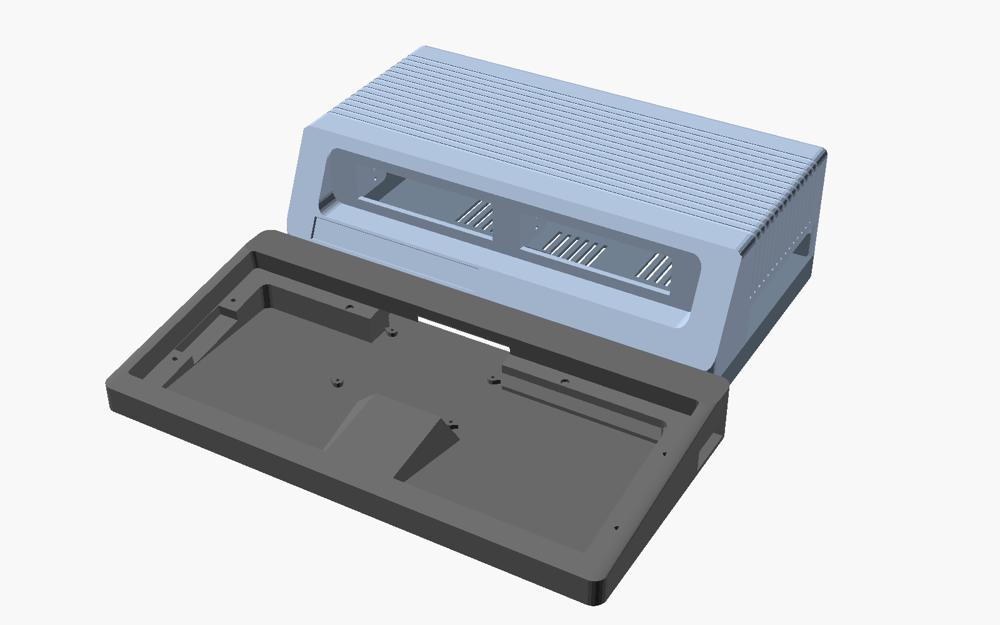

# CoCo3 Streamline Case

A parametric, 3D-printable replacement case for the Tandy Color Computer 3 (26-3334 motherboard), styled after
the never-released "CoCo4" prototype: a low keyboard deck in front of a taller louvered tower that houses the
motherboard and two 3.5" drive bays.



Everything is generated from OpenSCAD source ([`coco3_case.scad`](coco3_case.scad)). The motherboard outline,
mounting holes and connector positions come from a KiCad STEP model of the real board, so the rear ports and the
right-side cartridge slot line up with a stock CoCo3 board.

## Features

- **Fits a 250 x 250 mm bed.** The main case and keyboard shell are split into left/right halves, joined with M3
  screws, nuts and printed pins. "Whole" versions of each part are included for bigger printers.
- **Multipak-compatible cartridge slot.** The motherboard sits at the stock height above the desk, so a Multipak
  or a cartridge plugs into the right-side slot as it would on a stock case.
- **Keyboard shell** for either the original CoCo3 keyboard or an Artemis v3 replacement keyboard, each with its
  own bezel. The shell attaches with magnets (detachable) or bolts (permanent).
- **Two 3.5" drive bays** in the tower for floppy or Gotek drives, with filler plates for empty bays and a tray
  that holds a CoCo FujiNet board and its OLED display in a bay.
- **Modern I/O:** USB-C power input that replaces the OEM power connector, USB passthrough faceplates for a Pico-based
  USB keyboard controller, a rear panel for an HDMI/video add-on board, and mounting for a Raspberry Pi Zero
  (RGBtoHDMI) or an HDMI bulkhead coupler.
- **Build variants:**
  - **One-piece bottom.** The main bottom and keyboard shell print as a single part, for large printers
    (~334 x 341 mm footprint).
  - **Hinged lid.** The rear wall becomes part of the bottom and the top swings up on a 3 mm rod for access to the
    drives and motherboard.

## Which files to print

Ready-to-print STLs are in [`stl/`](stl) (the standard case) and [`hinged-stls/`](hinged-stls) (hinged-lid
versions of the main case parts). Pick one row from each group that applies:

| Part | Fits 250 mm bed (split) | Bigger printer (whole) |
|---|---|---|
| Main case bottom | `main_bottom_left` + `main_bottom_right` | `main_bottom_whole` |
| Main case top | `main_top_left` + `main_top_right` | `main_top_whole` |
| Keyboard shell | `keyboard_bottom_left` + `keyboard_bottom_right` + `keyboard_joiner_keys` | `keyboard_bottom_whole` |
| Keyboard bezel, stock keyboard | `bezel_oem_left` + `bezel_oem_right` | `bezel_oem_whole` |
| Keyboard bezel, Artemis v3 | `bezel_artemis_left` + `bezel_artemis_right` | `bezel_artemis_whole` |

Plus:

- `main_faceplate` and `keyboard_faceplate`: the USB/LED/button plates for the main case front and the keyboard's
  back wall.
- `keyboard_main_keys`: bow-tie keys that join the keyboard shell to the main bottom underneath.
- `keyboard_magnet_plugs` (detachable keyboard) **or** `keyboard_bridge_plate` (permanently attached keyboard).
- `usbc_clip`: holds the USB-C power board.
- Optional: `fujinet_tray`, `floppy_filler_plate` + 2x `floppy_filler_clip` (per empty bay).

**One-piece bottom (large printers):** print `bottom_one_piece` in place of the main bottom and keyboard shell
(and their keys/plugs), with `main_top_whole_1p` as the top. Its skirt is 5 mm taller to match.

**Hinged lid:** use the main case parts (`main_bottom_*`, `main_top_*`, `main_faceplate`, `bottom_one_piece`,
`main_top_whole_1p`) from `hinged-stls/`; everything else still comes from `stl/`.

## Hardware

- M3 screws throughout. By default they self-tap into 2.6 mm pilot holes; set `screw_mount_type = "heat_set"` for
  brass heat-set inserts (4.0 mm holes) instead.
- M3 x 10 (or x 12) socket-head screws and M3 nuts for the seams between split halves. Bolt the main case halves
  together *before* fitting the drives.
- 6 x 3 mm disc magnets for the detachable keyboard.
- 5 mm stick-on rubber feet.
- Hinged lid only: a 3 mm steel rod, about 306 mm long, glued at the ends.

## Building the STLs yourself

The STLs are generated from the `.scad` files by a build script. It needs an
[OpenSCAD development snapshot](https://openscad.org/downloads.html#snapshots) (2024 or later): the scripts use
the Manifold backend, which renders the whole set in seconds. The 2021.01 stable release doesn't have it.

```sh
./build_stls.sh                  # Linux / macOS: everything
./build_stls.sh hinged-stls      # just one folder
./build_stls.sh main_top_left    # just one part (in every folder that has it)
```

```bat
build_stls.cmd                   :: Windows, same arguments (or .\build_stls.ps1 from PowerShell)
```

The scripts find OpenSCAD on the `PATH` or in its default install location; set `OPENSCAD` to point at a specific
binary. The list of parts, with the settings each one is built with, is in [`stl_parts.txt`](stl_parts.txt).

## Customizing

Open `coco3_case.scad` in OpenSCAD and use the Customizer, or edit the variables at the top of the file. The most
useful ones:

| Variable | What it does |
|---|---|
| `part` | Which part to render. `"preview"` shows the case assembled; the full list is in the PART SELECTOR block at the end of the file. |
| `keyboard_attached` | `false` = detachable keyboard (magnets), `true` = bolted on. |
| `one_piece_bottom` | Fuse the main bottom and keyboard shell into one print. |
| `main_hinged` | Hinged-lid build. |
| `screw_mount_type` | `"self_tap"` or `"heat_set"`. |
| `new_foot_height` | Height of your stick-on feet. The standoffs adjust to keep the cartridge slot at Multipak height. |
| `tol` | General fit clearance. |

The floppy filler plate lives in its own file, [`coco3_floppy_filler.scad`](coco3_floppy_filler.scad).

## Status

This is a hobby project. Parts have been test-printed and fitted as the design evolved, but not every variant
has been printed. Check fit on your own printer before committing to a long print. A few dimensions are best
estimates, such as the height of the OEM rubber feet that the cartridge-height calculation starts from. They are
marked `PLACEHOLDER` / `TODO` in the source.

## Third-party files

These reference files are included for convenience and are **not** covered by this project's license. They
remain under their original owners' terms:

- `coco3.step`: CoCo3 motherboard model, from
  [qbancoffee/coco_motherboards](https://github.com/qbancoffee/coco_motherboards) (GPL-3.0).
- `coco4_reference.jpg`: photo of the CoCo4 prototype, used as the styling reference.
- `Artemis v3 bezel.stl`: bezel model for the Artemis v3 keyboard.
- `CoCo-FujiNet-Rev000.stl`: model of the CoCo FujiNet board.

## License

Copyright (c) 2026 Bill Athing.

Licensed under [Creative Commons Attribution 4.0 International (CC BY 4.0)](LICENSE). You can share, remix and
sell prints or derivatives, as long as you give credit, e.g. *"CoCo3 Streamline Case" by Bill Athing,
https://github.com/wdathing/Coco3StreamlineCase*, and note any changes you made.
